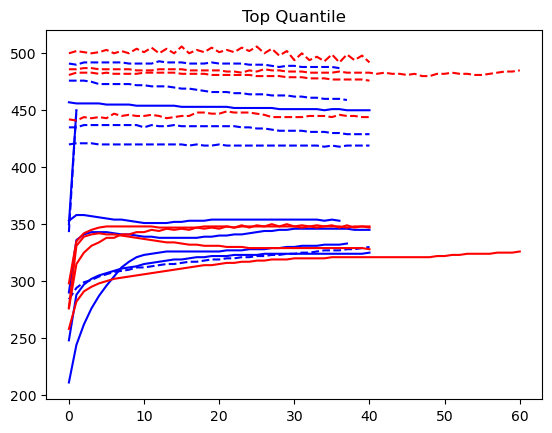
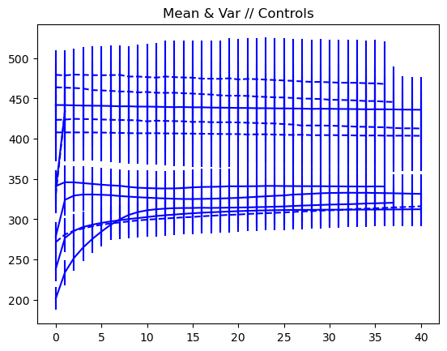
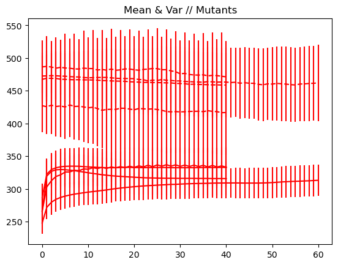

# Plasmodium analysis

This repo is a **work in progress 🚧** but contains incremental image analysis of _Plasmodium_ data, contained in the Jupyter notebook.

Mybinder functionality is provided but the data are too large to upload; other avenues are being looked into. For now, it's a good platform for ensuring all the dependencies are correctly configured.

## Simple fluorescence aggregation

The first approach we took was to perform simple fluorescence aggregation over time. This took a few different forms:
 - average (with and without variance bars)
 - median
 - upper quantile

Each of these showed the same story: **there was no obvious difference in the fluorescence patterns of controls versus mutants**.

The plots are shown below, but are also embedded in the static notebook file included in this repo.

In each of the following graphs, the axes are the same: `x` is time (or frame number in the original video), and `y` is the aggregate fluorescence of that frame, where the aggregation strategy is specified by the graph title (e.g., mean, median).

Blue are the controls, red are the mutants. There were two channels per video, so the first channel is a solid line, and the second channel to the same video is a dashed line.

